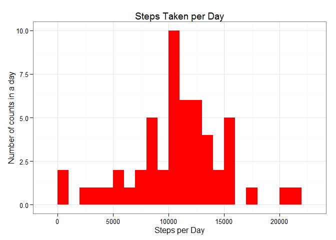
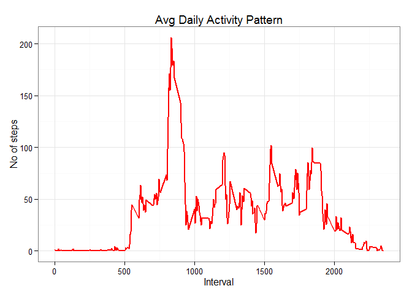
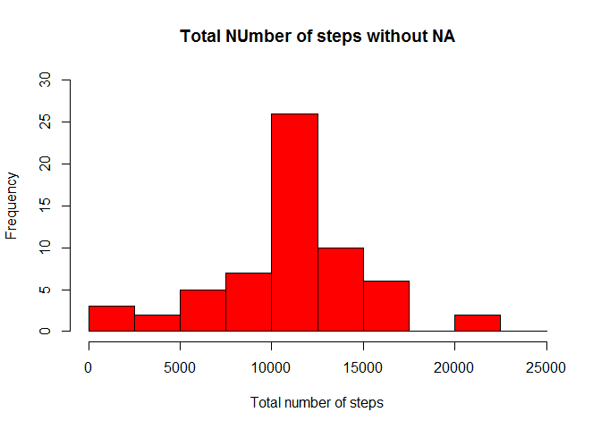
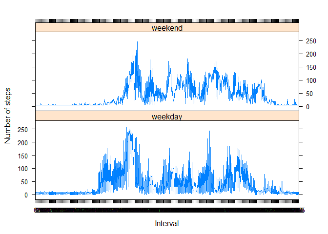

# Reproducible Research: Peer Assessment 1


## Loading and preprocessing the data

```r
library(knitr)
```

```
## Warning: package 'knitr' was built under R version 3.2.2
```

```r
opts_chunk$set(echo = TRUE, results = 'hold')
library(data.table)
```

```
## Warning: package 'data.table' was built under R version 3.2.2
```

```r
library(ggplot2) # we shall use ggplot2 for plotting figures
```

```
## Warning: package 'ggplot2' was built under R version 3.2.2
```

```r
library(lattice) # for series plot

rdata <- read.csv('activity.csv', header = TRUE, sep = ",",colClasses=c("numeric", "character", "numeric"))
rdata$date <- as.Date(rdata$date, format = "%Y-%m-%d")
rdata$interval <- as.factor(rdata$interval)
```
## What is mean total number of steps taken per day?

```r
stepsperday <- aggregate(steps ~ date, rdata, sum)
colnames(stepsperday) <- c("date","steps")
head(stepsperday)
#Now lets make a histogram of the total number of steps taken each day 
ggplot(stepsperday, aes(x = steps)) + geom_histogram(fill = "red", binwidth = 1000) + labs(title="Steps Taken per Day", x = "Steps per Day", y = "Number of counts in a day") + theme_bw() 
```

 

```r
#now lets calc mean and meadian
steps_mean   <- mean(stepsperday$steps, na.rm=TRUE)
steps_mean
steps_median <- median(stepsperday$steps, na.rm=TRUE)
steps_median
```

```
##         date steps
## 1 2012-10-02   126
## 2 2012-10-03 11352
## 3 2012-10-04 12116
## 4 2012-10-05 13294
## 5 2012-10-06 15420
## 6 2012-10-07 11015
## [1] 10766.19
## [1] 10765
```
## What is the average daily activity pattern?

```r
stepsperinterval <- aggregate(rdata$steps,by = list(interval = rdata$interval),FUN=mean, na.rm=TRUE)
#lets convert interval column to integer
stepsperinterval$interval <- as.integer(levels(stepsperinterval$interval)[stepsperinterval$interval])
colnames(stepsperinterval) <- c("interval", "steps")
ggplot(stepsperinterval, aes(x=interval, y=steps)) +geom_line(color="red", size=1) + labs(title="Avg Daily Activity Pattern", x="Interval", y="No of steps") +  theme_bw()
```

 

```r
head(stepsperinterval)
maxnoin5min <- stepsperinterval[which.max(stepsperinterval$steps),]
maxnoin5min
```

```
##   interval     steps
## 1        0 1.7169811
## 2        5 0.3396226
## 3       10 0.1320755
## 4       15 0.1509434
## 5       20 0.0754717
## 6       25 2.0943396
##     interval    steps
## 104      835 206.1698
```
## Imputing missing values

```r
#Total number of missing values:
total_nas <- sum(is.na(rdata$steps))
total_nas
#Devise a strategy for filling in all of the missing values in the dataset
#finding NA Positions
napos <- which(is.na(rdata$steps))
#create vector using the position variable
mean_vec <- rep(mean(rdata$steps, na.rm=TRUE), times=length(napos))
#Create a new dataset that is equal to the original dataset but with the missing data filled in.
rdata[napos, "steps"] <- mean_vec
head(rdata)
#Make a histogram of the total number of steps taken each day and Calculate and report the mean and median total number of steps taken per day.
totalsteps <- aggregate(rdata$steps, by=list(rdata$date), FUN=sum)
names(totalsteps) <- c("date", "total")
hist(totalsteps$total, breaks=seq(from=0, to=25000, by=2500),col="red", xlab="Total number of steps", ylim=c(0, 30),main="Total NUmber of steps without NA" )
```

 

```r
steps_mean   <- mean(totalsteps$total)
steps_mean
steps_median <- median(totalsteps$total)
steps_median
```

```
## [1] 2304
##     steps       date interval
## 1 37.3826 2012-10-01        0
## 2 37.3826 2012-10-01        5
## 3 37.3826 2012-10-01       10
## 4 37.3826 2012-10-01       15
## 5 37.3826 2012-10-01       20
## 6 37.3826 2012-10-01       25
## [1] 10766.19
## [1] 10766.19
```
## Are there differences in activity patterns between weekdays and weekends?

```r
#Create a new factor variable in the dataset with two levels - "weekday" and "weekend" indicating whether a given date is a weekday or weekend day.
#defining weekdays vs. weekends
rdata <- data.frame(date=rdata$date,weekday=tolower(weekdays(rdata$date)),steps=rdata$steps,interval=rdata$interval)
rdata <- cbind(rdata, daytype=ifelse(rdata$weekday == "saturday" | rdata$weekday == "sunday", "weekend", "weekday"))
rdata <- data.frame(date=rdata$date, weekday=rdata$weekday, daytype=rdata$daytype, interval=rdata$interval, steps=rdata$steps)
# Compute the average number of steps taken, averaged across all daytype variable
avg_steps<- aggregate(rdata$steps,by=list(rdata$daytype,rdata$weekday, rdata$interval), mean)
names(avg_steps) <- c("daytype", "weekday", "interval", "mean")
head(avg_steps)
# creating time series plot using rdata
xyplot(mean ~ interval | daytype, avg_steps, type="l", lwd=1, xlab="Interval", ylab="Number of steps", layout=c(1,2))
```

 

```r
rm(rdata)
```

```
##   daytype  weekday interval     mean
## 1 weekday   friday        0 8.307244
## 2 weekday   monday        0 9.418355
## 3 weekend saturday        0 4.672825
## 4 weekend   sunday        0 4.672825
## 5 weekday thursday        0 9.375844
## 6 weekday  tuesday        0 0.000000
```
